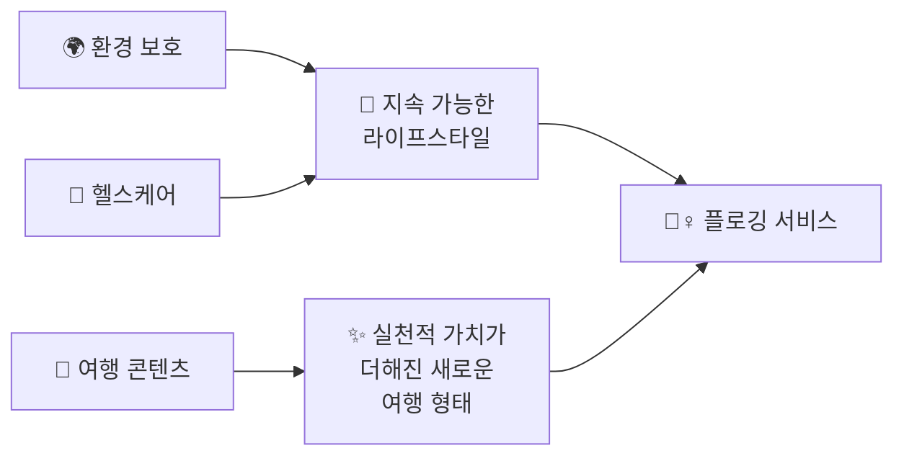
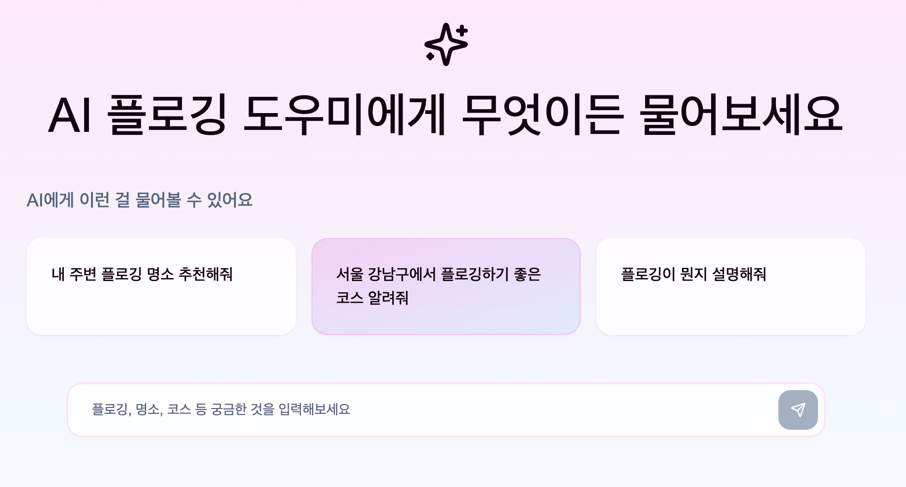
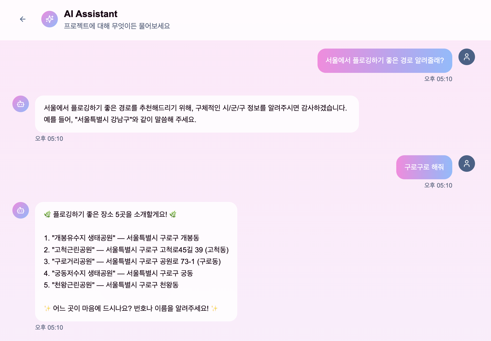
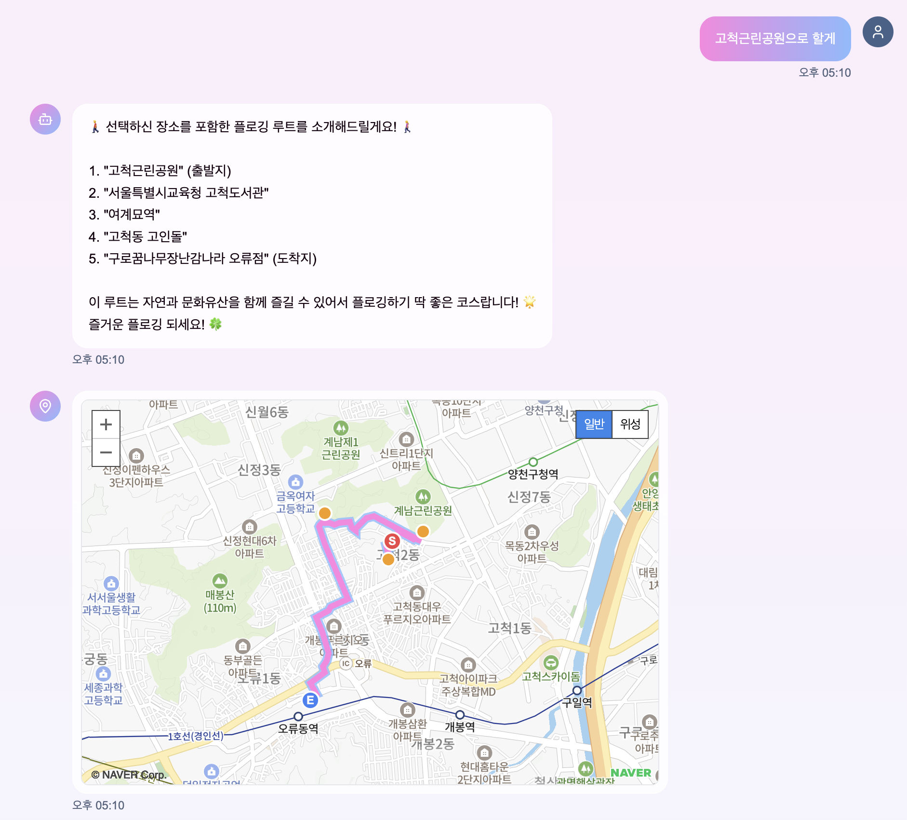
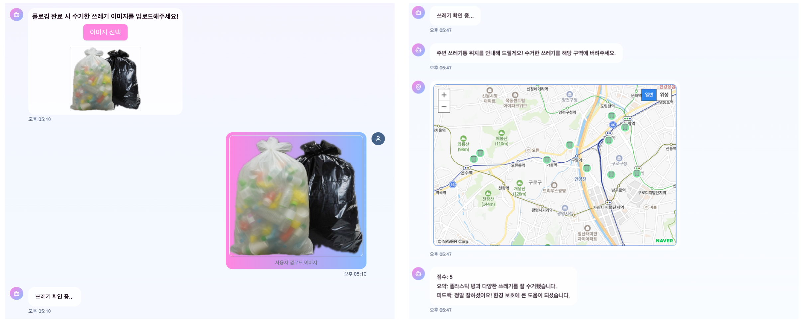
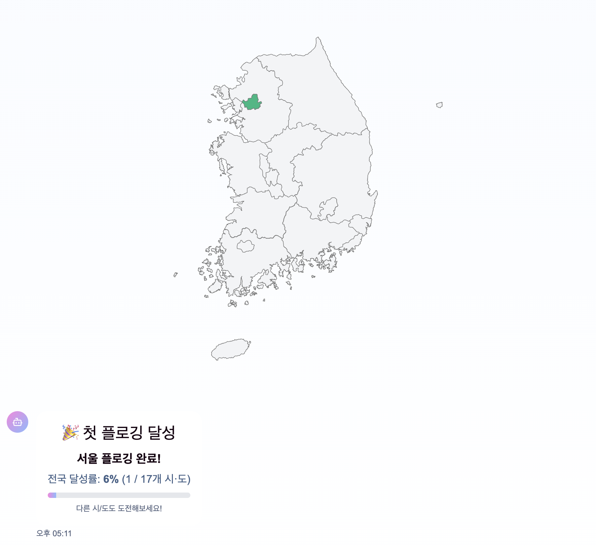

# 🌱 온새미: 여행하듯! 플로깅

### 🧭 **주제**  
플로깅 기반 지역 탐방 및 환경 보호 서비스

---

## 👥 팀 소개

<div align="center">

### 🌱 **팀명: 온새미**  

</div>

### 👨‍💻 **팀 구성**

<table align="center">
<tr>
<td align="center" width="200px">

<br/><b><a href="https://github.com/JaylenHan" target="_blank">한승헌</a></b><br/>🔸 팀장<br/>
<i>LLM & Prompt</i>
</td>
<td align="center" width="200px">

<br/><b><a href="https://github.com/kimsw99" target="_blank">김성욱</a></b><br/>🔸 팀원<br/>
<i>Backend</i>
</td>
<td align="center" width="200px">

<br/><b><a href="https://github.com/seunghyeokkim" target="_blank">김승혁</a></b><br/>🔸 팀원<br/>
<i>Frontend</i>
</td>
</tr>
</table>

### 🎯 **팀 배경**
- IT와 환경이라는 두 키워드를 실제 행동으로 연결하기 위한 **사회적 실험**을 목표로 구성  
- **프롬프트 기반 AI 서비스** 기획 및 구현 경험 보유  
- 기술뿐 아니라 **사용자 행동을 유도하는 프롬프트 설계**에 높은 관심을 가진 구성원 중심

---

## 🏁 대회 참여 사유

<div align="center">

| 🎯 **목표** | 📈 **성장** | 🚀 **도전** |
|:---:|:---:|:---:|
| **AI 기반 실천형 서비스**로<br/>환경, 건강 등<br/>사회 이슈 해결을 지향 | 창의적인 아이디어를 현실화하며<br/>**팀워크와 기술 역량**을<br/>강화하고자 함 | 생성형 AI 시대의<br/>**UX/인터랙션 설계**를<br/>직접 경험하고 도전하기 위함 |

</div>

---

## 📌 과제 소개

<div align="center">

### ✅ **서비스 기능**

| 🗺️ **장소 추천** | 🛣️ **루트 안내** | 📸 **인증 및 리워딩** |
|:---:|:---:|:---:|
| 사용자의 요청에 따라<br/>플로깅에 적합한<br/>장소를 추천 | 선택한 장소를 기반으로<br/>**맞춤형 루트 및 코스**<br/>제공 | 플로깅 종료 후<br/>**사진 인증 및 보상 시스템**을<br/>통해 참여 동기 부여 |

</div>

### 🎯 **주제 선정 사유**

<div align="center">



</div>

- 환경 보호와 헬스케어를 동시에 달성할 수 있는 **지속 가능한 라이프스타일** 제안  
- 환경에 대한 관심 증가에 따라 **플로깅 참여자** 수요 확대  
- 기존 관광 콘텐츠에 **실천적 가치**를 더한 새로운 여행 형태 제안

---

## 👤 타깃 사용자

<div align="center">

### 🎯 **타깃층**

```
🏃‍♀️ 걷기나 러닝을 즐기며  
💚 건강과 일상 모두를 챙기고 싶은  
🌟 모든 사람들
```

</div>

---

## 🖼️ 주요 UI 구성

<div align="center">

### 📱 **앱 화면 구성**

</div>

#### 1️⃣ **시작 화면**
<div align="center">

<br/><i>🏠 메인 화면에서 플로깅 여행을 시작하세요</i>
</div>

<br/>

#### 2️⃣ **지역 정보 추출 및 플로깅 장소 추천**
<div align="center">

<br/><i>🗺️ AI가 분석한 최적의 플로깅 장소를 확인하세요</i>
</div>

<br/>

#### 3️⃣ **플로깅 루트 추천**
<div align="center">

<br/><i>🛣️ 맞춤형 루트로 효율적인 플로깅을 계획하세요</i>
</div>

<br/>

#### 4️⃣ **쓰레기 평가 및 쓰레기통 위치 제공 (RAG 기반)**
<div align="center">

<br/><i>🗑️ <a href="https://www.data.go.kr/data/15129450/standard.do">공공데이터</a>를 활용한 스마트한 쓰레기 관리</i>
</div>

<br/>

#### 5️⃣ **플로깅 목표 달성 화면**
<div align="center">

<br/><i>🏆 플로깅 완료! 환경 보호에 기여한 성과를 확인하세요</i>
</div>

---

## 🎥 사용 시연 영상

[](https://www.youtube.com/watch?v=YZpdy_qJjEM)

👉 이미지를 클릭하면 YouTube 영상으로 이동합니다.


## 프로젝트 구조

- **Frontend**: Next.js + TypeScript + Tailwind CSS
- **Backend**: FastAPI + Python
- **지도 서비스**: T맵, 네이버 지도 API
- **AI 서비스**: LaaS API(GPT-4o)를 통한 관광지 추천

## 설치 및 실행

### 1. 프론트엔드 설정

```bash
# 의존성 설치
npm install

# 환경변수 설정
cp .env.example .env.local
# .env.local 파일에서 필요한 값들을 설정
```

#### 프론트엔드 환경변수

`.env.local` 파일에 다음 환경변수들을 설정하세요:

```bash
# T맵 API 키 (필수)
NEXT_PUBLIC_TMAP_KEY=your_tmap_api_key_here

# 네이버 지도 API 키 (필수)
NEXT_PUBLIC_NAVER_MAP_KEY=your_naver_map_key_here
```

```bash
# 개발 서버 실행
npm run dev
```

### 2. 백엔드 설정

```bash
cd backend

# 가상환경 생성 및 활성화
python -m venv venv
source venv/bin/activate  # Windows: venv\Scripts\activate

# 의존성 설치
pip install -r requirements.txt

# 환경변수 설정
cp .env.example .env
# .env 파일에서 필요한 값들을 설정
```

#### 백엔드 환경변수

`backend/.env` 파일에 다음 환경변수들을 설정하세요:

```bash
# LaaS API 설정 (필수)
LAAS_API_KEY=your_laas_api_key_here
PROJECT_CODE=your_project_code_here
LAAS_URL=https://api-laas.wanted.co.kr/api/preset/v2/chat/completions

# T맵 API 키 (필수)
TMAP_API_KEY=your_tmap_api_key_here

# 한국관광공사 API 키 (필수)
Tour_API_KEY=your_tour_api_key_here

# LaaS 컬렉션 해시 값들 (필수)
HASH_LOCATION=your_location_hash_here
HASH_PLACE=your_place_hash_here
HASH_ROUTE=your_route_hash_here
HASH_IMAGE=your_image_hash_here
HASH_TRASHBAG=your_trashbag_hash_here
HASH_RAG=your_rag_hash_here
```

```bash
# 백엔드 서버 실행
python main.py
```

## API 키 발급 방법

### 1. T맵 API 키
1. [SK Open API](https://openapi.sk.com/) 회원가입
2. T맵 API 서비스 신청
3. 발급받은 API 키를 환경변수에 설정

### 2. 네이버 지도 API 키
1. [네이버 클라우드 플랫폼](https://www.ncloud.com/) 회원가입
2. AI·Application Service > Maps 서비스 이용 신청
3. 발급받은 Client ID를 환경변수에 설정

### 3. 한국관광공사 API 키
1. [한국관광공사 Tour API](https://www.visitkorea.or.kr/kto/dev/openApiInfo.do) 회원가입
2. 관광정보 서비스 API 키 신청
3. 발급받은 API 키를 환경변수에 설정

### 4. LaaS API 키
1. LaaS 서비스 가입 및 프로젝트 생성
2. API 키 및 프로젝트 코드 발급
3. 각 컬렉션별 해시 값 설정

## 주요 기능

- 🗺️ **지역 기반 플로깅 장소 추천**: 사용자가 입력한 지역의 플로깅 장소 추천
- 🛣️ **경로 안내**: T맵 API를 통한 최적 경로 제공
- 💬 **AI 챗봇**: 관광 관련 질문 답변
- 📸 **이미지 업로드**: 사진을 통한 장소 인식 및 정보 제공
- 🗑️ **쓰레기통 위치 안내**: 관광지 주변 쓰레기통 위치 정보

## 기술 스택

- **Frontend**: Next.js 14, TypeScript, Tailwind CSS, Radix UI
- **Backend**: FastAPI, Python 3.8+
- **Maps**: T맵 API, 네이버 지도 API
- **AI**: LaaS API, 한국관광공사 API
- **Deployment**: Vercel (Frontend), 기타 클라우드 서비스 (Backend)

## 라이센스

이 프로젝트는 MIT 라이센스로 배포됩니다.
